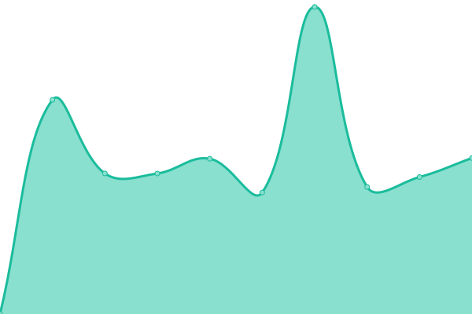
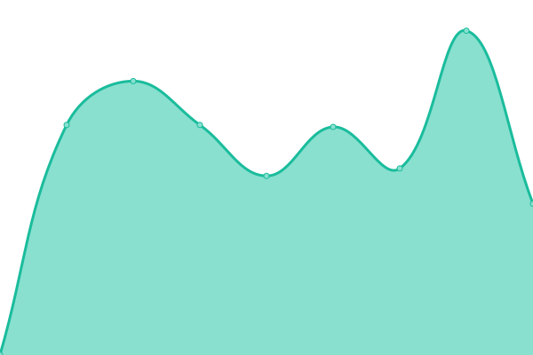
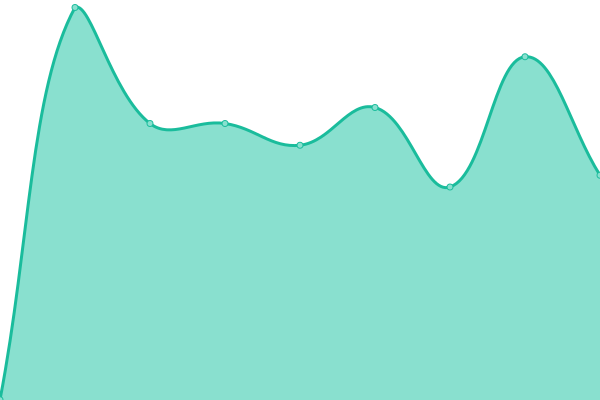

# [📈 Live Status](https://status.iamdt.cn): <!--live status--> **所有系统运行正常**

This repository contains the open-source uptime monitor and status page for [冬天冬天 W](www.iamdt.cn), powered by [Upptime](https://github.com/upptime/upptime).

With [Upptime](https://upptime.js.org), you can get your own unlimited and free uptime monitor and status page, powered entirely by a GitHub repository. We use [Issues](https://github.com/inwinter04/upptime/issues) as incident reports, [Actions](https://github.com/inwinter04/upptime/actions) as uptime monitors, and [Pages](https://status.iamdt.cn) for the status page.

<!--start: status pages-->
<!-- This summary is generated by Upptime (https://github.com/upptime/upptime) -->
<!-- Do not edit this manually, your changes will be overwritten -->
<!-- prettier-ignore -->
| 链接 | 状态 | 历史 | 响应时间 | 正常运行时间 |
| --- | ------ | ------- | ------------- | ------ |
|  [冬天的小窝 S1W3](https://www.iamdt.cn/) | 🟩 正常运行 | [s1-w3.yml](https://github.com/inwinter04/upptime/commits/HEAD/history/s1-w3.yml) | 

 1933ms
     
 | 

<a href="https://status.iamdt.cn/history/s1-w3">99.72%</a>
    

|  [冬天的个人主页 S1W1](https://me.iamdt.cn/) | 🟩 正常运行 | [s1-w1.yml](https://github.com/inwinter04/upptime/commits/HEAD/history/s1-w1.yml) | 

 1179ms
     
 | 

<a href="https://status.iamdt.cn/history/s1-w1">99.57%</a>
    

|  [冬天的导航站 SVW2](https://me.iamdt.cn/) | 🟩 正常运行 | [svw-2.yml](https://github.com/inwinter04/upptime/commits/HEAD/history/svw-2.yml) | 

 227ms
     
 | 

<a href="https://status.iamdt.cn/history/svw-2">99.73%</a>
    

|  [冬天的必应壁纸 SVW1](https://bing.iamdt.cn/) | 🟩 正常运行 | [svw-1.yml](https://github.com/inwinter04/upptime/commits/HEAD/history/svw-1.yml) | 

 354ms
     
 | 

<a href="https://status.iamdt.cn/history/svw-1">100.00%</a>
    

|  [阿里云OSS节点](https://img.iamdt.cn/2024/03/16/65f56d4dd7bae.ico) | 🟩 正常运行 | [oss.yml](https://github.com/inwinter04/upptime/commits/HEAD/history/oss.yml) | 

 1659ms
     
 | 

<a href="https://status.iamdt.cn/history/oss">99.36%</a>
    

<!--end: status pages-->

[**Visit our status website →**](https://status.iamdt.cn)

## 📄 License

- Powered by: [Upptime](https://github.com/upptime/upptime)
- Code: [MIT](./LICENSE) © [Anand Chowdhary](https://anandchowdhary.com), supported by [Pabio](https://pabio.com)
- Data in the `./history` directory: [Open Database License](https://opendatacommons.org/licenses/odbl/1-0/)
